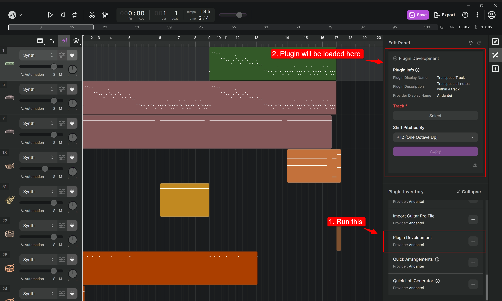

# tuneflow-devkit-py

Debugger for tuneflow-py.

[](https://dev.azure.com/zeostudio/tuneflow-public/_build/latest?definitionId=34&branchName=main)
[](https://pypi.org/project/tuneflow-devkit-py/)
[](https://discord.com/channels/1076012137161424906/1076012755250851860)

## Requirements

Python >= 3.7

## Installation

```bash
pip install tuneflow-devkit-py
```

> **Note:** You may need to make sure the version of `tuneflow-py` is compatible with the `tuneflow-devkit-py` you are using. To do that, check the `requirements.txt` in `tuneflow-devkit-py` and see if its `tuneflow-py` is set to the same version as your `tuneflow-py`.

## Run a Python TuneFlow Plugin With `tuneflow-devkit-py`

To run a plugin locally, we need to create a debug server that hosts the plugin and talks to TuneFlow. Let's call it `debug.py`, which is as simple as 3 lines of code (see [debug.py](https://github.com/tuneflow/tuneflow-py-demos/blob/main/src/debug.py) for an example):

```python
# debug.py

from your_plugin_path import YourPlugin
from tuneflow_devkit import Debugger

if __name__ == "__main__":
    Debugger(plugin_class=YourPlugin).start()
```

To use it, simply run:

```bash
python debug.py
```

The plugin will then be loaded into a local debug server that talks to TuneFlow Desktop.

Next, start **TuneFlow Desktop** and run the `Plugin Development` plugin.

You will see the plugin loaded into TuneFlow Desktop in debug mode.



Run the loaded plugin in TuneFlow Desktop, you will be able to see your python plugin executed.

## Examples

The easiest way to learn how to write plugins is through examples. To view all example projects, check out https://github.com/tuneflow/tuneflow-py-demos.

## Debug Your Plugin

When developing our plugin, we need to set breakpoints and watch variables as we execute the plugin. The setup varies with different IDEs, we'll use VSCode as an example below.

First create a debug config in `.vscode/launch.json` under your working directory, and fill it with something like below:

```json
{
  "version": "0.2.0",
  "configurations": [
    {
      "name": "Python: Current File",
      "type": "python",
      "request": "launch",
      "program": "${file}",
      "console": "integratedTerminal",
      "justMyCode": true,
      "env": {
        "PYTHONPATH": "<your python path here>"
      }
    }
  ]
}
```

Next, in our plugin-related files, we need to set the breakpoints by clicking the space next to the line number:


Finally, open the debug entry file `debug.py`. In VSCode debug panel, set debug target to `Python: Current File` and click the start button.


Now, when you run the plugin, you will be able to stop at breakpoints and view your variables.


> **Note:** For more information on how to debug python code in VSCode, see https://code.visualstudio.com/docs/python/debugging

## Making code changes when debugging your plugin

When you change your plugin code, you will need to exit the devkit and restart it. Please note that **you need to exit the "Plugin Development" plugin in TuneFlow when you exit the devkit**, so that the next time you start the devkit, "Plugin Development" plugin can be initialized correctly.

## Contributing

Read [Contributing](./CONTRIBUTING.md)

## Resources

- [TuneFlow Typescript Plugin](https://github.com/andantei/tuneflow)
- [TuneFlow Typescript Dev Kit](https://github.com/andantei/tuneflow-devkit)
- [TuneFlow Basic Plugins in Typescript](https://github.com/andantei/tuneflow-plugin-basic)
- [插件系统是如何运作的？](https://help.tuneflow.com/zh/developer/how-we-run-plugins.html)
